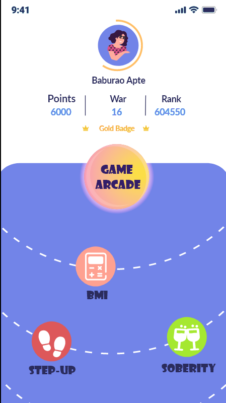
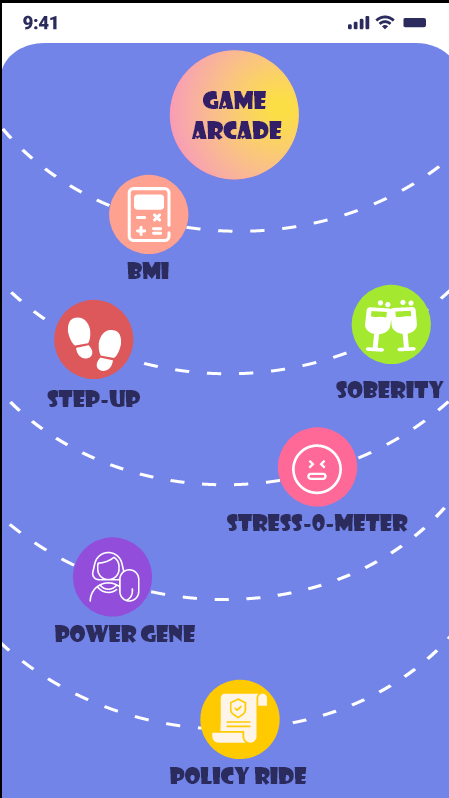

# CH46_BRAINBYTE

 

## SIH 2020 Software Edition CH46 | Team BrainByte

Health-Arena is an application which can securely collect the user data & create awareness amongst its users regarding the health insurence policies which are available over it's market place. The application uses a dynamic mathematical modal to recommend user the best sutable policy for him / her. The user can make use of different activities present in the app to further look after his health. This app recommends insurance policies to the user as well as urges him to be healthy. The user experience of application is made engaging by rewarding the user with health point, badges, etc. whenever he successfully completes a certain activity.

### Technology Stack
* Android SDK MVVM
* Kotlin [Front End]
* Firebase Firestore Object Orented DB
* NodeJS & PHP [BackEnd]

### Specification
* minSdkVersion 21 | Android v5.1.0
* targetSdkVersion 30 | Android v11.0

### Preview

###PPT
https://github.com/Sharanya98/CH46_BRAINBYTE-1/blob/master/BrainByte_CH46_SIH2020.pdf
